# Azure Resources Overview - YTHUANG(MCAPS) Subscription

## Architecture Diagram

```mermaid
graph TB
    subgraph Subscription["☁️ YTHUANG(MCAPS) Subscription"]
        
        subgraph RG_AAI["📦 Resource Group: AAI (Southeast Asia)"]
            AI1["🤖 AI Services: icsuaaisea<br/>Region: Southeast Asia"]
            AI2["🤖 AI Services: icsuaaieus<br/>Region: East US"]
            AI3["🤖 AI Services: icsuaaieus2<br/>Region: East US 2"]
            AI4["🤖 AI Services: icsuaaije<br/>Region: Japan East"]
            AI5["🤖 AI Services: icsuaaijpe<br/>Region: Japan East"]
            AI6["🤖 AI Services: icsuaaikc<br/>Region: Korea Central"]
            AI7["🤖 AI Services: icsuaaiuaen<br/>Region: UAE North"]
            AI8["🤖 AI Services: icsuaaisc<br/>Region: Sweden Central"]
            AI9["🤖 AI Services: icsuaaiwus<br/>Region: West US"]
            AI10["🤖 AI Services: icsuaaiwus3<br/>Region: West US 3"]
            
            SA1["💾 Storage: icsuaaischubsa<br/>SKU: Standard_LRS<br/>Tier: Hot"]
            SA2["💾 Storage: icsuaaiscsa<br/>SKU: Standard_LRS<br/>Tier: Hot"]
            
            KV1["🔐 Key Vault: icsuaaischubkv<br/>Region: Sweden Central"]
            
            ML1["🧠 ML Workspace"]
            ML2["🧠 ML Workspace"]
            
            LAW1["📊 Log Analytics<br/>DefaultWorkspace-1"]
            LAW2["📊 Log Analytics<br/>DefaultWorkspace-2"]
            
            AI1 -.-> SA1
            AI8 -.-> SA2
            AI8 -.-> KV1
        end
        
        subgraph RG_INVOICE["📦 Resource Group: Invoice-AI (Southeast Asia)"]
            SA3["💾 Storage: invoiceaisea<br/>SKU: Standard_LRS<br/>Tier: Hot"]
            APPINS1["📈 App Insights"]
        end
        
        subgraph RG_LAB4_STAGING["📦 Resource Group: lab4-tf-staging-rg (Southeast Asia)"]
            SA4["💾 Storage: lab4stagingsadb78496f<br/>SKU: Standard_LRS<br/>Tier: Hot"]
            EG1["📨 EventGrid Topic"]
        end
        
        subgraph RG_LAB4_PROD["📦 Resource Group: lab4-tf-prod-rg (Southeast Asia)"]
            SA5["💾 Storage: lab4prodsadb78496f<br/>SKU: Standard_GRS<br/>Tier: Hot"]
            EG2["📨 EventGrid Topic"]
        end
        
        subgraph RG_LAB7["📦 Resource Group: lab7-rg (Southeast Asia)"]
            SA6["💾 Storage: lab7sar0lcm6<br/>SKU: Standard_LRS<br/>Tier: Hot"]
            TAGS7["🏷️ Tags:<br/>Owner: platform-team<br/>Project: lab7<br/>Team: platform-team"]
        end
        
        subgraph RG_LAB1["📦 Resource Group: lab1tf-rg (Southeast Asia)"]
            SA7["💾 Storage: lab1760bed<br/>SKU: Standard_LRS<br/>Tier: Hot"]
        end
        
        subgraph RG_SHELL["📦 Resource Group: Shell (Southeast Asia)"]
            SA8["💾 Storage: shellseasa<br/>SKU: Standard_LRS<br/>Tier: Hot<br/>(Cloud Shell)"]
            EG3["📨 EventGrid Topic"]
        end
        
        subgraph RG_BING["📦 Resource Group: BingSearch (Japan East)"]
            BING["🔍 Bing Search: bsg<br/>Region: Global"]
        end
        
        subgraph RG_DOMAINS["📦 Resource Group: DomainNames (West US)"]
            DNS1["🌐 DNS Zone x5"]
            DOM1["📋 Domain Registration x5"]
        end
        
        subgraph RG_WORKSHOP["📦 Resource Group: techworkshop-l300-ai-agents (East US 2)"]
            WORKSHOP["🎓 Workshop Resources"]
        end
        
        subgraph RG_NETWORK["📦 Resource Group: NetworkWatcherRG"]
            NW1["👁️ Network Watcher<br/>Southeast Asia"]
            NW2["👁️ Network Watcher<br/>Central US"]
            NW3["👁️ Network Watcher<br/>Other Regions"]
        end
        
        subgraph RG_DEFAULT_SEA["📦 Resource Group: DefaultResourceGroup-SEA"]
            LAW3["📊 Log Analytics<br/>DefaultWorkspace-SEA<br/>Retention: 30 days"]
        end
        
        subgraph RG_DEFAULT_SWC["📦 Resource Group: DefaultResourceGroup-swedencentral"]
            LAW4["📊 Log Analytics<br/>DefaultWorkspace-swedencentral<br/>Retention: 30 days"]
        end
        
        subgraph RG_ALERTS["📦 Resource Group: Default-ActivityLogAlerts (East US)"]
            AG1["🔔 Action Group"]
            ALERT1["⚠️ Smart Detector Rules x2"]
        end
    end
    
    style Subscription fill:#e1f5ff,stroke:#0078d4,stroke-width:3px
    style RG_AAI fill:#fff4e6,stroke:#ff8c00,stroke-width:2px
    style RG_INVOICE fill:#f0fff0,stroke:#32cd32,stroke-width:2px
    style RG_LAB4_STAGING fill:#ffe6f0,stroke:#ff1493,stroke-width:2px
    style RG_LAB4_PROD fill:#ffe6e6,stroke:#dc143c,stroke-width:2px
    style RG_LAB7 fill:#f0f0ff,stroke:#4169e1,stroke-width:2px
    style AI1 fill:#dda0dd,stroke:#800080,stroke-width:2px
    style AI8 fill:#dda0dd,stroke:#800080,stroke-width:2px
    style KV1 fill:#ffd700,stroke:#b8860b,stroke-width:2px
    style SA5 fill:#90ee90,stroke:#006400,stroke-width:2px
```

## Regional Distribution

## Resource Type Distribution

## Infrastructure Summary

### 🤖 AI & Cognitive Services (10 instances)
Multi-region deployment across:
- **Asia Pacific**: Southeast Asia, Japan East (×2), Korea Central
- **Middle East**: UAE North
- **Americas**: East US, East US 2, West US, West US 3
- **Europe**: Sweden Central

All using **S0 SKU** (Standard tier)

### 💾 Storage Accounts (8 accounts)

| Name | Resource Group | Location | SKU | Tier | Purpose |
|------|----------------|----------|-----|------|---------|
| icsuaaischubsa | AAI | Sweden Central | Standard_LRS | Hot | AI Hub Storage |
| icsuaaiscsa | AAI | Sweden Central | Standard_LRS | Hot | AI Services Storage |
| invoiceaisea | Invoice-AI | Southeast Asia | Standard_LRS | Hot | Invoice AI |
| lab4stagingsadb78496f | lab4-tf-staging-rg | Southeast Asia | Standard_LRS | Hot | Staging Env |
| **lab4prodsadb78496f** | lab4-tf-prod-rg | Southeast Asia | **Standard_GRS** | Hot | **Production Env** |
| lab7sar0lcm6 | lab7-rg | Southeast Asia | Standard_LRS | Hot | Lab 7 |
| lab1760bed | lab1tf-rg | Southeast Asia | Standard_LRS | Hot | Lab 1 |
| shellseasa | Shell | Southeast Asia | Standard_LRS | Hot | Cloud Shell |

### 🔐 Security & Identity
- **Key Vault**: 1 instance (icsuaaischubkv in Sweden Central)
- **Managed Identities**: Integrated with AI Services

### 📊 Monitoring & Observability
- **Log Analytics Workspaces**: 4 instances
  - DefaultWorkspace-SEA (Southeast Asia)
  - DefaultWorkspace-swedencentral (Sweden Central)
  - 2 additional in AAI resource group
- **Application Insights**: 2 instances
- **Action Groups**: 1 for alerts
- **Smart Detector Rules**: 2 for AI-based alerting

### 🌐 Networking
- **Network Watchers**: 3 instances (Southeast Asia, Central US, others)
- **No Virtual Networks**: Currently using PaaS services without custom VNets
- **No Public IPs**: All services using managed networking

### 🌍 DNS & Domains
- **DNS Zones**: 5 configured
- **Domain Registrations**: 5 registered domains (in West US)

### 🔍 Search & Other Services
- **Bing Search**: 1 account (global)
- **EventGrid System Topics**: 8 (auto-created for storage accounts)
- **Machine Learning Workspaces**: 2

## Resource Group Organization

| Resource Group | Location | Resources | Tags | Purpose |
|----------------|----------|-----------|------|---------|
| AAI | Southeast Asia | 16+ | ❌ None | AI Services Hub |
| Invoice-AI | Southeast Asia | 2+ | ❌ None | Invoice Processing |
| lab4-tf-staging-rg | Southeast Asia | 2 | ❌ None | Lab 4 Staging |
| lab4-tf-prod-rg | Southeast Asia | 2 | ❌ None | Lab 4 Production |
| lab7-rg | Southeast Asia | 2+ | ✅ Yes | Lab 7 (Tagged) |
| lab1tf-rg | Southeast Asia | 2+ | ❌ None | Lab 1 |
| Shell | Southeast Asia | 2 | ❌ None | Cloud Shell Storage |
| BingSearch | Japan East | 1 | ❌ None | Bing Search API |
| DomainNames | West US | 10 | ❌ None | DNS & Domains |
| techworkshop-l300-ai-agents | East US 2 | ? | ❌ None | Workshop |
| NetworkWatcherRG | Multiple | 3 | ❌ None | Network Monitoring |
| DefaultResourceGroup-SEA | Southeast Asia | 1 | ❌ None | Default Monitoring |
| DefaultResourceGroup-swedencentral | Sweden Central | 1 | ❌ None | Default Monitoring |
| Default-ActivityLogAlerts | East US | 3 | ❌ None | Activity Alerts |

## Key Observations

### ✅ Strengths
1. **Comprehensive AI Coverage**: Global AI Services deployment for low-latency access
2. **Production Protection**: GRS replication on production storage
3. **Monitoring Setup**: Multiple Log Analytics workspaces and alerting configured
4. **Security**: Key Vault in use for secrets management
5. **Multi-region**: Good geographic distribution for global access

### ⚠️ Areas for Improvement
1. **Resource Tagging**: Only 1 out of 14 resource groups has tags
2. **AI Services Consolidation**: 10 instances may be over-provisioned
3. **Storage Tier Optimization**: All using Hot tier (consider Cool/Archive)
4. **Log Analytics Duplication**: Multiple default workspaces in same region
5. **Lab Resource Cleanup**: Several lab environments may be unused
6. **No VNet Architecture**: Consider network isolation for production workloads
7. **Cost Management**: No visible budget alerts or cost allocation

### 💰 Cost Optimization Opportunities
- Consolidate AI Services from 10 regions to 2-3 strategic locations
- Review and move infrequently accessed blobs to Cool/Archive tier
- Consolidate duplicate Log Analytics workspaces
- Delete unused lab resources
- Implement comprehensive tagging for cost allocation

---

**Generated:** November 7, 2025  
**Subscription:** YTHUANG(MCAPS)  
**Total Resource Groups:** 14  
**Total Resources:** 60+
