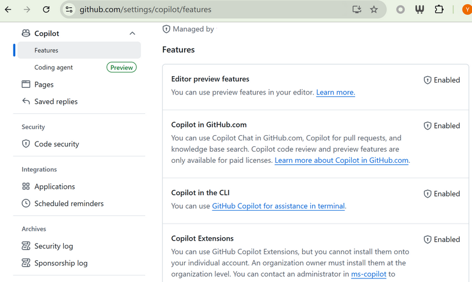
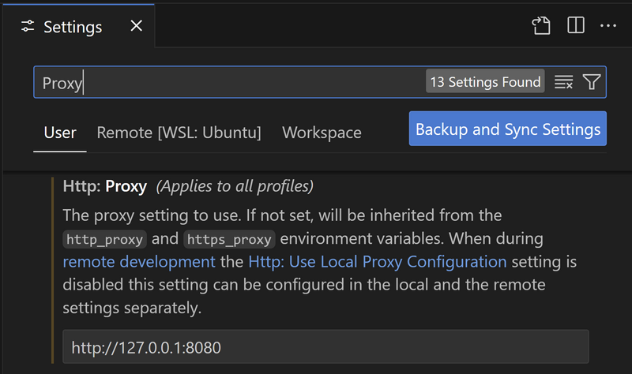
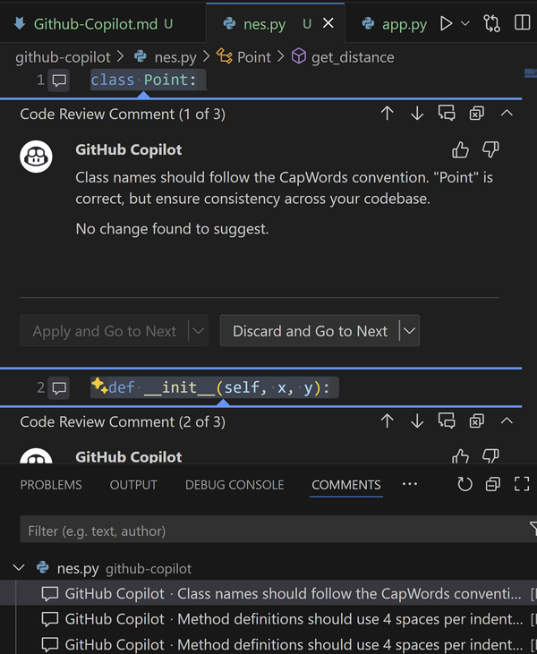
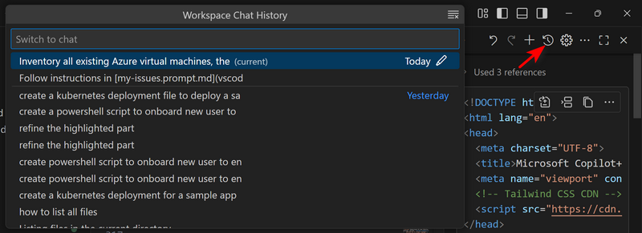
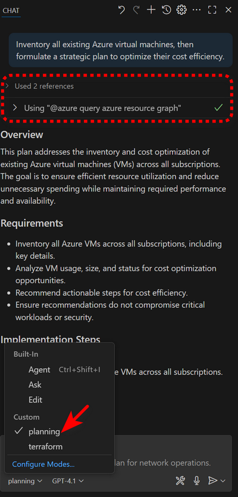
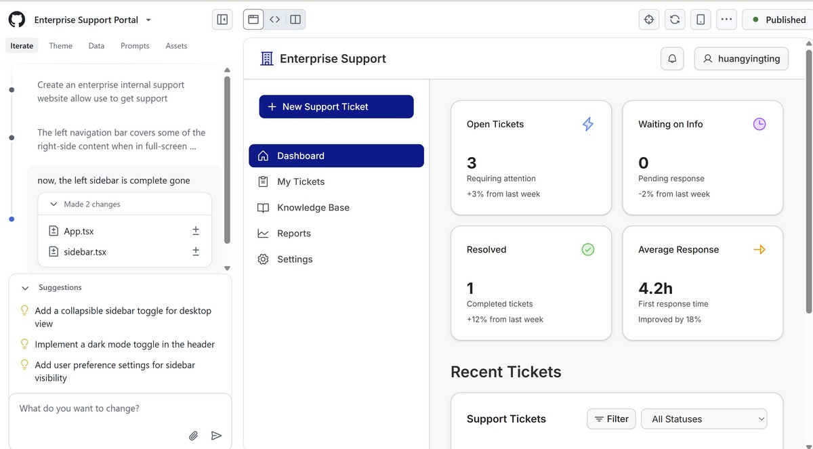
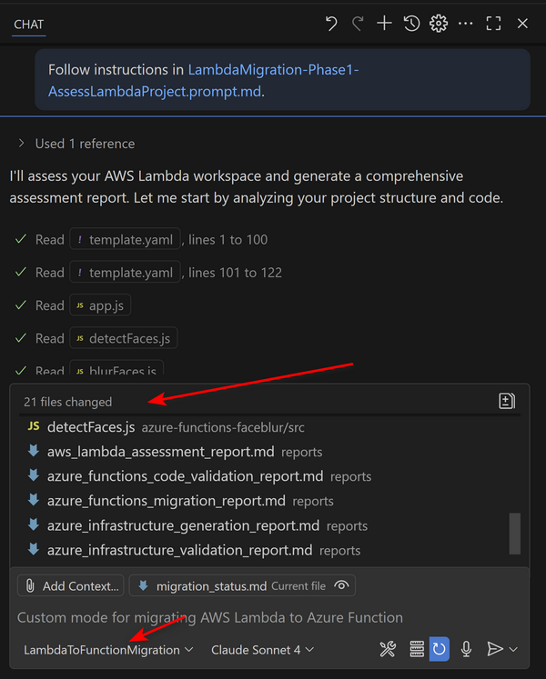
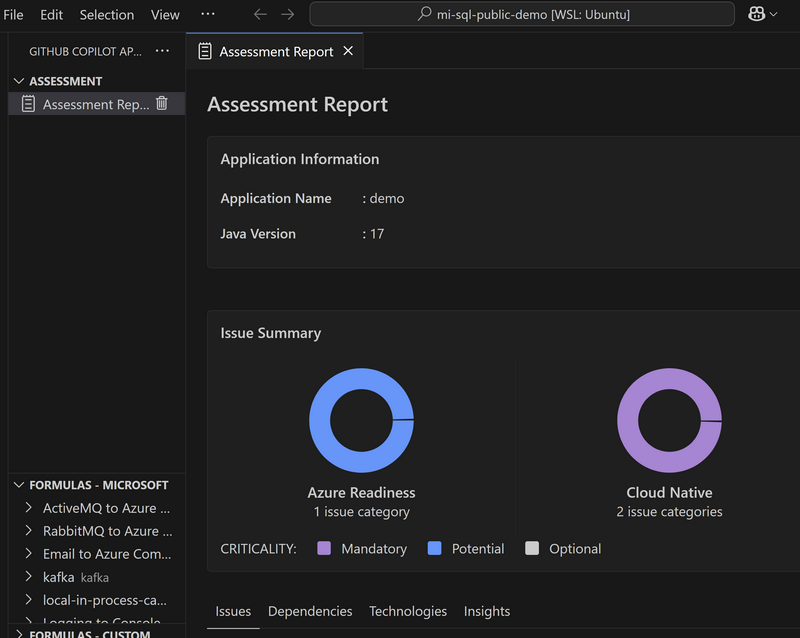
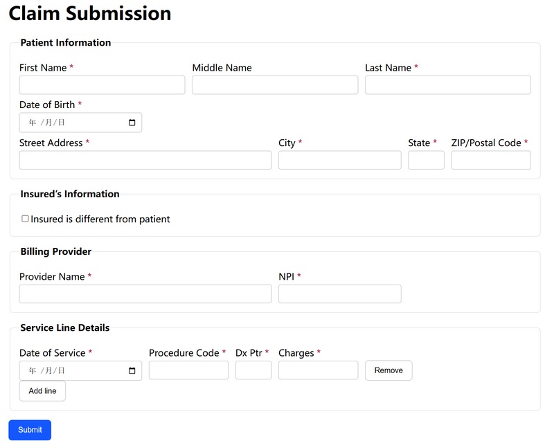
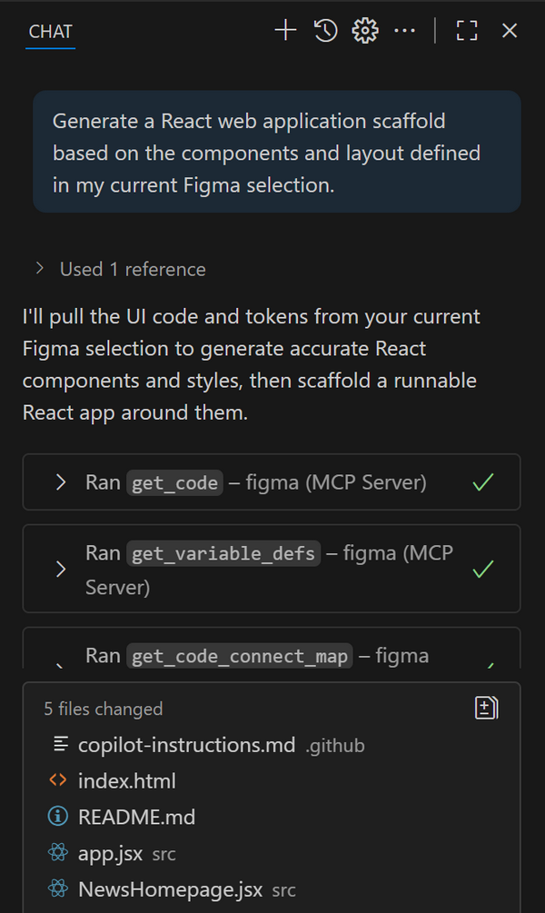

# Github Copilot Workshop
Your end-to-end guide to installation, features, chat, customization, enterprise networking, and hands-on labs

<!-- SPEAKER_NOTES_START
- Welcome everyone to the GitHub Copilot Workshop
- This deck condenses the README into presentation-ready slides
- We’ll cover setup, features, enterprise considerations, customizations, and hands-on labs
SPEAKER_NOTES_END -->

---

## Agenda
- Module 1: Overview and Key Concepts
- Module 2: Installation and Configuration
- Module 3: Networking, Security, and Data Flow
- Module 4: Customization and Fine-Tuning
- Module 5: Core Coding Features
- Module 6: Copilot Chat
- Module 7: Advanced Features and Agent Mode
- Module 8: Copilot Spaces
- Module 9: Use Cases
- Module 10: Hands-On Exercises

---

## Module 1: Overview and Key Concepts
- AI coding assistant across IDEs, GitHub.com, CLI, Desktop, Mobile
- Conversational coding, commit assistance, real-time web search
- Editor Preview: multi-file edits, next-step suggestions
- Copilot Extensions integrate third-party tools via Marketplace
- Coding Agent (Preview) automates issues and PRs, powered by MCP

<!-- SPEAKER_NOTES_START
- Describe model families and where Copilot runs
- Note the emerging capabilities in Editor Preview
SPEAKER_NOTES_END -->

---

## Module 1 - Key Features
- Get code suggestions as you type
- Make large-scale changes across multiple files
- Ask questions about coding issues
- Refactor and improve your code structure
- Fix bugs and debug your code
- Set up foundational code for new projects or files
- Configure and generate tests
- Generate documentation for your code

---

## Module 1 - Scenarios
- Regular expressions; boundary condition validation
- Hard-to-remember keywords, e.g., HTML/CSS
- Algorithms or unfamiliar languages
- Complete object fields by common sense
- Understand complex code; generate documentation
- Generate unit tests
- Summarize PR changes; Agent mode edits

---

## Module 1 - Supported Models
- OpenAI: o3, o3-mini, o4-mini (Preview), GPT-5 (Preview)
- Anthropic Claude: Sonnet 3.5/3.7/4, Opus 4
- Google Gemini: 2.0 Flash, 2.5 Pro (Preview)

---

## Module 2: Installation and Configuration
- Install GitHub Copilot extension in your IDE
- Sign in to GitHub and enable Copilot features
- Verify network connectivity or configure proxy if required
- Optional: Install mitmproxy for traffic inspection lab
- Link: GitHub Copilot Features settings page



---

## Module 2 - IDE Settings
- Install extension(s) and recommended plugins
- Review and adjust key settings as needed
- VS Code: open user settings JSON for advanced config
- Example: enterprise authProvider; commit message instructions

```JSON
{
  "github.copilot.advanced": { "authProvider": "github-enterprise" },
  "github.copilot.chat.commitMessageGeneration.instructions": [
    { "text": "Follow the conventional commits format strictly ..." }
  ]
}
```

---

## Module 3: Networking, Security, and Data Flow
- Understand enterprise network paths and controls
- Proxy and firewall issues can block Copilot
- WebSockets, TLS inspection, certificate pinning conflicts
- Rate limiting, VPN constraints, zero trust policies
- Reference allowlist and network settings docs


---

## Module 3 - Common Network Issues
- Blocked domains and misconfigured proxy variables
- TLS/SSL inspection breaks encrypted traffic integrity
- WebSocket limitations; dropped persistent connections
- PAC file misrouting; IDS/IPS false positives
- Firewall ACLs or VPN routing issues



---

## Module 3 - Inspecting Traffic (Linux)
- Use mitmproxy to inspect Copilot traffic
- Configure IDE proxy to localhost:8080
- Install mitmproxy CA certificate into system trust
- Sample trace available in repository

```bash
mitmdump --listen-host 0.0.0.0 --listen-port 8080 --mode regular --flow-detail 4
openssl x509 -in ~/.mitmproxy/mitmproxy-ca-cert.pem -inform PEM -out ~/.mitmproxy/mitmproxy-ca-cert.crt
sudo mkdir /usr/share/ca-certificates/extra
sudo cp ~/.mitmproxy/mitmproxy-ca-cert.crt /usr/share/ca-certificates/extra/mitmproxy-ca-cert.crt
sudo dpkg-reconfigure ca-certificates
sudo update-ca-certificates
```

---

## Module 4: Customization and Fine-Tuning
- Default deployment vs lightweight custom instructions
- Deep customization with custom models (note deprecation)
- Knowledge Base for enterprise-grounded answers
- Community-contributed instructions and prompts


---

## Module 5: Core Coding Features
- Comment-to-function generation (Python example)
- Pattern completion in constructors and boilerplate
- Next Edit Suggestions (NES) to chain edits
- Refactor, modify, review with inline experiences




---

## Module 6: Copilot Chat
- Shortcuts for Chat View, Quick Chat, Inline Chat
- Real-time collaboration on current file/selection
- Prompt examples for explain, fix, tests, docs
- Use @ participants and # variables for context
- Built-in slash commands for frequent tasks




---

## Module 7: Advanced + Agent Mode
- Extensions add domain-specific tools into Chat
- Copilot Edit: up to 10 files, rate limited
- Agent mode: multi-step, less deterministic, preview
- MCP servers supercharge agentic operations
- Custom instructions and org-level governance

---

## Module 8: Copilot Spaces
- Organize context for teams; share curated spaces
- Onboarding, system knowledge, style guides
- System instructions to ground responses
- Example space for code generation


---

## Use Cases Overview
- Network Operations Planning
- Architecture Design to Azure Terraform Script
- Work with Azure MCP
- Work with M365 Graph API
- PowerShell Script Generation
- Context7 Integration for Up-to-date Code
- Use Coding Agent for Azure Terraform
- Create Enterprise Support Portal with Spark
- Migrate AWS Lambda to Azure Functions
- Modernize Java Applications with Copilot
- Spec-Driven Development with Copilot
- Design to Code (Figma MCP)

---

## Network Operations Planning
- Goal: optimize Azure network resources and cost
- Context: custom chat mode for network planning
- Key asset: Network Planning image reference

```txt
Could you please review my existing Azure network resources and share recommendations to improve optimization and cost-efficiency in the overall network architecture?
```


---

## Architecture Design to Terraform
- Goal: generate Terraform from architecture diagram
- Context: use custom chat mode
- Asset: Azure-Arch.png referenced

```txt
Based on the architecture outlined in Azure-Arch.png, please generate a Terraform deployment script that provisions the corresponding resources.
```


---

## Work with Azure MCP
- Goal: visualize deployed resources
- Start azure-mcp server from mcp.json

```txt
Please generate a Mermaid diagram that provides an overview of all my currently deployed resources.
```

---

## Work with M365 Graph API
- Goal: list calendar meetings
- Start microsoft-graph MCP server

```txt
Please list out my meetings for tomorrow
```

---

## PowerShell Script Generation
- Goal: onboard new users from CSV (enterprise demo)
- Steps: create AD user, license, add to Teams group
- Include robust error handling and logging

```txt
PowerShell script to onboard new users from a CSV file named 'new_hires.csv'.
The script must perform the following actions for each user:
1. Import the CSV (FirstName, LastName, Department, Title).
2. Generate a secure, random initial password.
3. Create an AD user in OU matching Department.
4. Construct UPN 'firstname.lastname@yourcompany.com'.
5. Assign a Microsoft 365 E5 license to the new user.
6. Add the user to the 'All-Staff' Microsoft Teams group.
7. Include robust error handling with try/catch blocks.
8. Log all actions to a transcript file.
```

---

## Context7 Integration
- Goal: real-time code suggestions/updates
- Context: keep codebase aligned with best practices

```txt
Create a Next.js middleware that checks for a valid JWT in cookies and redirects unauthenticated users to `/login`. use context7
```

---

## Coding Agent for Azure Terraform
- Goal: scripts and GitHub workflows from diagram
- Use Mermaid diagram to drive resource provisioning



---

## Enterprise Support with GitHub Spark
- Goal: no-code micro apps for support portal
- Demo link and sample app provided


- Demo: Use Spark to Create Enterprise Support Website
- App: Enterprise Support (public link)

---

## Migrate Lambda to Azure Functions
- Use GitHub Copilot for Azure extension
- Add custom chat mode; migrate functions
- Reference sample repo: serverless-face-blur-service



---

## Modernize Java Applications
- Use Copilot to refactor and optimize Java
- Reference: Java Migration Copilot Samples



---

## Spec-Driven Development
- Files: requirements.md, design.md, tasks.md
- Process: define, design, task, implement
- Sample: Claim-Pilot application walkthrough



---

## Design to Code (Figma MCP)
- Generate React app from Figma components
- Use Dev Mode MCP server and prompts



---

## Module 10: Hands-On Overview
- Exercise 1: Azure CLI rapid provisioning
- Exercise 2: PowerShell automation runbooks
- Exercise 3: Terraform for core web app
- Exercise 4: Refactor Bicep with best practices
- Exercise 5: Mermaid architecture diagrams
- Exercise 6: SQL schema and procedure generation
- Exercise 7: Multi-stage Dockerfile authoring
- Exercise 8: Kubernetes manifests for AKS

---

## Exercise 1: Azure CLI Provisioning
- Objective: create RG, storage, container quickly
- Tools: gh copilot, @azure chat, az CLI
- Steps: suggest RG; generate storage; create blob
- Outcome: resources visible in Azure portal

---

## Exercise 2: PowerShell Runbooks
- Objective: stop tagged VMs on schedule
- Auth: managed identity; robust logging
- Steps: params, connect, query tagged VMs, stop
- Outcome: automated cost savings

---

## Exercise 3: Terraform Web App
- Objective: App Service, Web App, SQL DB
- Refinements: firewall rule, variables, outputs
- Outcome: validated Terraform plan

---

## Exercise 4: Refactor Bicep
- Objective: modularize and align with best practices
- Steps: generate monolith, explain, refactor modules
- Outcome: simplified main, reusable modules

---

## Exercise 5: Mermaid Diagrams
- Objective: visualize cloud-native architecture
- Steps: prompt, embed code, preview in VS Code
- Outcome: clear diagrams in documentation

---

## Exercise 6: SQL Schemas
- Objective: create Orders table, stored procedure
- Context: provide Customers schema for accuracy
- Outcome: correct DDL and DML artifacts

---

## Exercise 7: Dockerfile Authoring
- Objective: multi-stage, small secure image
- Steps: builder stage; slim runtime; .dockerignore
- Outcome: production-ready container image

---

## Exercise 8: Kubernetes Manifests
- Objective: deploy Flask app on AKS
- Resources: Deployment (3 replicas), Service (LB)
- Outcome: public app on port 80

---

## Conclusion / Next Steps
- Explore Copilot Extensions and custom modes
- Apply enterprise networking best practices
- Reuse prompts and spaces for team workflows
- Continue with hands-on labs and demos

<!-- SPEAKER_NOTES_START
- Encourage attendees to try exercises in their environment
- Solicit feedback on enterprise setup and demos
SPEAKER_NOTES_END -->